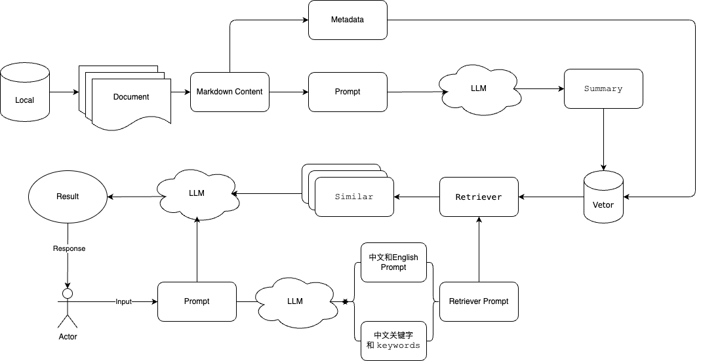

# github-star-rag

`github-star-rag`是一个基于简初级 RAG 架构的实现的检索器，能够用于检索 Github 用户 Star 的项目中与提问内容具备相关性的结果，并简要地展示相关的项目信息。你可以视作这是一个具备理解能力、评估和检索能力的 Github-Star 项目 AI 搜索功能。

# 环境部署

```bash
git clone https://github.com/Airmomo/github-star-rag.git
cd github-star-rag
pip install -r requirements.txt
cd client
npm install
```

# 运行

```bash
# 启动服务端
cd github-star-rag/service
python main.py
# 启动客户端
cd github-star-rag/client
npm start
open localhost:3000
```

# RAG 架构设计



# 主页


# 设置


- GITHUB_TOKEN：GITHUB 的密钥，到设置去申请，需要开启必要的访问权限，这里只用于获取用户 Star 的项目信息。
- LLM_API_BASE：大语言模型的 API 接口地址
- LLM_API_KEY：大语言模型的 API 访问密钥
- LLM_MODEL_NAME：大语言模型的名称（这里需要选择上下文在 8K 以上的模型，有些 Star 项目信息过长会被模型限制。）
- EMBEDDING_API_BASE：嵌入模型的 API 接口地址
- EMBEDDING_API_KEY：嵌入模型的 API 访问密钥
- EMBEDDING_MODEL_NAME：嵌入模型的名称
- 检索结果数量：指的是在进行向量检索后返回的数量，非 LLM 最终回答的结果数量。（数量越高，则需要更长的上下文长度，但能得到更多样的回答。）

设置在首次保存后，会自动开始初始化，届时将进行对 Github 中用户已 Star 的项目信息，并进行向量存储。**Star 的项目越多，初始化的过程则越慢，可以通过查看服务端的运行日志获得更详细的信息。**

## 模型支持

本项目使用`OpenAI`和`智谱AI`两个框架进行开发，所以基本只要支持使用这两个框架的`聊天模型`和`嵌入模型`都是支持的。

目前已测试的有`DeepSeek`、`OpenAI`和`智谱AI`，国内推荐使用`DeepSeek`或者`智谱AI`的模型，最新的模型上下文长度都是非常足够的。

# 提问（提示）

在初始化成功后，则可以通过客户端中的输入框，输入想要检索的信息或问题作为提示，LLM 将在您的 Github 中 Star 的项目中，根据问题检索出那些能够解决问题或具备强相关性的项目信息。

## 提示注意事项

- 不支持提问如`请列出Star数目排名前10的项目`等与 Star 数量相关的问题，最终输出结果的排名不分前后。
- 不是每一个提问都会有结果返回，需要 Star 的项目中具有与问题有一定的相关性的项目。
- **输出结果的展示默认为`简体中文`，如果想要得到其他语言检索结果，可以在提问中增加如`用XX语言回答我`的提示来得到预期语言的检索结果。**

# 检索结果展示


# Enjoy it!
